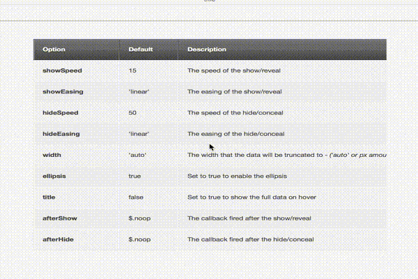

# makeSticky 0.0.2

Another sticky headers plugin!? WTF! Well, there is one thing this solves and that's horizontal scrolling. Please note, this is a work in progress. Current Master works.

## Why?

Most sticky jQuery plugins work great! But there was one thing that they didn't tackle well. `overflow-y`. Why not? Well, most of them use the `float` property to achieve the *sticky* behavior. This, unfortunately, doesn't play nice with relevant parents. So when you go to scroll right, or left it all goes to hell.

When working with headers, specifically in tables and even more specifically: mobile tables, you really don't have the luxury of maintaining a reasonable horizontal width. I mean, have you tried making a fluid table on an iPhone? Oh you have? How about one with 20 columns (smart ass)? Exactly. Not pretty.

## What does it do different?

Well, let me show you good developer let me show you (mystic music):

## BYOCSS

I should let you know that it's **BYOCSS** *(and for those who have never attended a party that means: Bring Your Own CSS... I learned that from a friend. No one invites me to parties. Ever.)*

But why? Because, this is meant for mobile and you don't want an iPhone 4 *(that is still supported and pretty popular from the time of this writing)* busting out all kinds of unnecessary front-end js *(gosh, why do you ask so many questions)*. So just style the header and make sure it's set to `position:absolute;` and quit the crying. See the sample stuff in the source code.

## Usage

Okay, so how does thing thing work? Well, I'm happy you asked! Checkout the code:

    $(document).ready(function(){
        $(".sticky").makeSticky();
    });

"That's it!" -Tim Cook (Introduction of Apple Pay). I figured since I made you do the CSS, I'd make it easy to call it.

## The Good News

You are awesome, but you already knew that. Besides that, because this puppy uses `absolute` positioning, you can actually scroll from left to right and keep the header above it's respective columns.

## The Bad News

It's kind of a jerk... Well when you scroll down slowly it jerks. A lot. So to ease the tremors here's a little Anticholinergics:

    .sticky {
    	position: absolute;

    	top: 0px;
    	right: 0px;
    	left: 0px;
    	margin: 0px;

    	width: auto;

    	-webkit-transition: 60ms /* safari and chrome */
    	transition: 60ms;
    }

Oh what? CSS3? I know what you're thinking: *You shouldn't be using CSS3, not all browsers support it.* Okay, sir, sit down. Chrome and Safari use it and guess what, those are the only browsers that mobile user use and THIS PLUGIN IS FOR MOBILE. Stop judging man, let me finish this documentation.

This is where you come in. Lets fix this thing and keep if from jerking.

### Installing:

Use this github or you can use [Jam](http://jamjs.org), a **CML package manager** for JavaScript:

    jam install makeSticky

